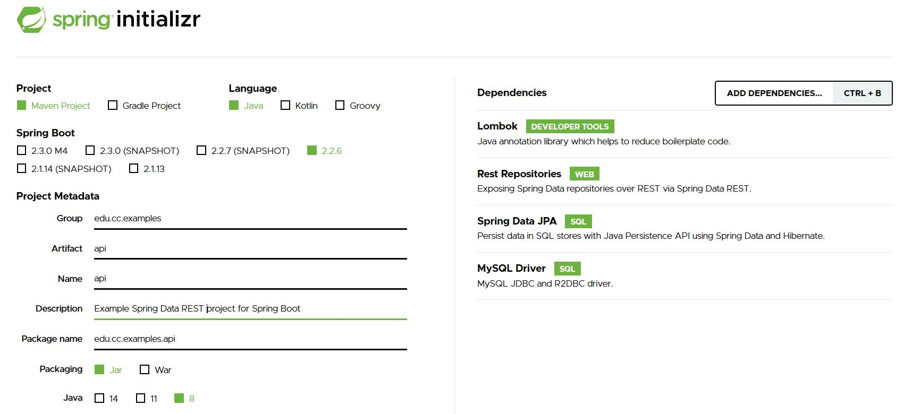
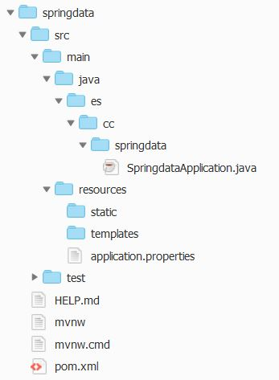
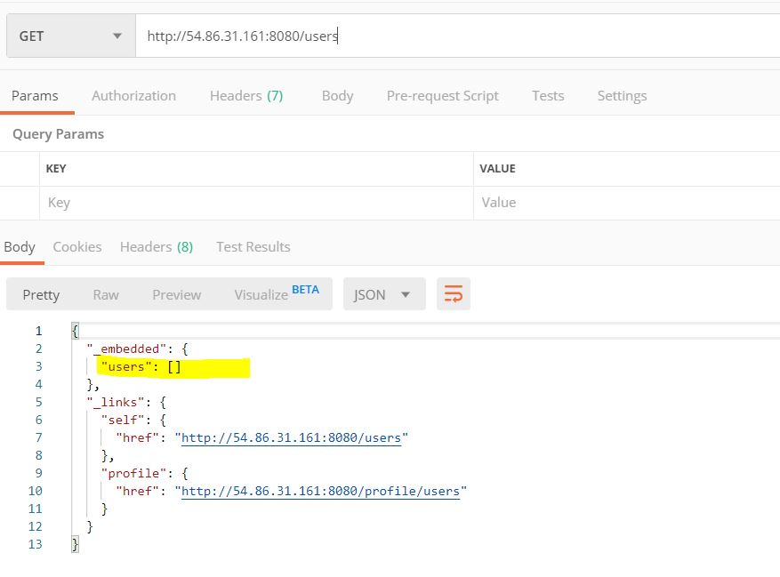
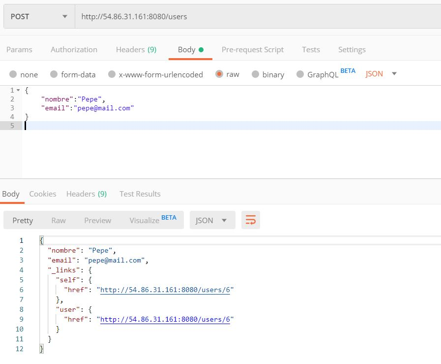
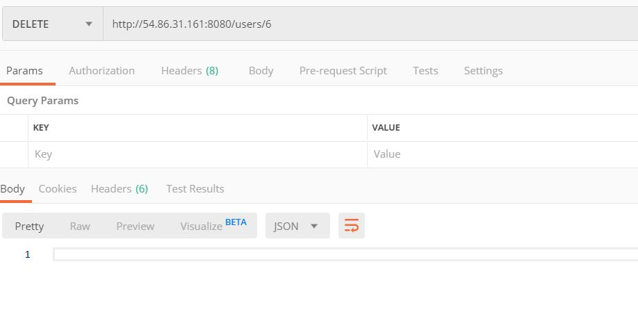

# Spring


## Requisitos

- Entorno de Desarrollo (IDE - Integrated Developer Environment (IDE), como Spring Tools, Visual Studio Code, Eclipse o cualquier otro. En esta guía se utilizará AWS Cloud9.

- Kit de desarollo de Java (JDK - Java Development Kit), como Open JDK o Java SE JDK.

## Spring Boot

La forma más fácil de crear aplicaciones Spring es utilizar Spring Boot mediante el Initializr.
Spring Initializr es un servicio online que ofrece una forma rápida para
crear la estrutura de un proyecto, incluyendo las dependencias de la aplicación.

Puede acceder a este servicio mediante https://start.spring.io/.

Crea un proyecto según se muestra en la figura:



Haz clic en "Generate" para guardar el fichero con la estructra del proyecto e importa el contenido
a tu IDE, en este caso AWS Cloud9.

La estructura del proyecto sería la siguiente:



## Fichero pom.xml

El fichero pom.xml debe tener el siguiente contenido:

```xml
<?xml version="1.0" encoding="UTF-8"?>
<project xmlns="http://maven.apache.org/POM/4.0.0" xmlns:xsi="http://www.w3.org/2001/XMLSchema-instance"
	xsi:schemaLocation="http://maven.apache.org/POM/4.0.0 https://maven.apache.org/xsd/maven-4.0.0.xsd">
	<modelVersion>4.0.0</modelVersion>
	<parent>
		<groupId>org.springframework.boot</groupId>
		<artifactId>spring-boot-starter-parent</artifactId>
		<version>2.2.6.RELEASE</version>
		<relativePath/> <!-- lookup parent from repository -->
	</parent>
	<groupId>edu.cc.examples</groupId>
	<artifactId>api</artifactId>
	<version>0.0.1-SNAPSHOT</version>
	<name>api</name>
	<description>Demo project for Spring Boot</description>

	<properties>
		<java.version>1.8</java.version>
	</properties>

	<dependencies>
		<dependency>
			<groupId>org.springframework.boot</groupId>
			<artifactId>spring-boot-starter-data-jpa</artifactId>
		</dependency>
		<dependency>
			<groupId>org.springframework.boot</groupId>
			<artifactId>spring-boot-starter-data-rest</artifactId>
		</dependency>

		<dependency>
			<groupId>mysql</groupId>
			<artifactId>mysql-connector-java</artifactId>
			<scope>runtime</scope>
		</dependency>
		
		<dependency>
			<groupId>org.projectlombok</groupId>
			<artifactId>lombok</artifactId>
			<optional>true</optional>
		</dependency>
		
		<dependency>
			<groupId>org.springframework.boot</groupId>
			<artifactId>spring-boot-starter-test</artifactId>
			<scope>test</scope>
			<exclusions>
				<exclusion>
					<groupId>org.junit.vintage</groupId>
					<artifactId>junit-vintage-engine</artifactId>
				</exclusion>
			</exclusions>
		</dependency>
	</dependencies>

	<build>
		<plugins>
			<plugin>
				<groupId>org.springframework.boot</groupId>
				<artifactId>spring-boot-maven-plugin</artifactId>
			</plugin>
		</plugins>
	</build>

</project>
```

## Aplicación principal

La aplicación principal del proyecto es src/main/java/es/cc/springdata/SpringdataApplication.java:

```java
package es.cc.springdata;

import org.springframework.boot.SpringApplication;
import org.springframework.boot.autoconfigure.SpringBootApplication;

@SpringBootApplication
public class SpringdataApplication {

	public static void main(String[] args) {
		SpringApplication.run(SpringdataApplication.class, args);
	}

}
```

## Configuración del proyecto

En el fichero src/main/resources/application.properties podemos incluir propiedades de configuración del proyecto.

En este caso, vamos a incluir la configuración para la conexión a la base de datos (una instancia de MySQL en AWS)

```
# fichero application.properties

spring.datasource.url= jdbc:mysql://${AWS_MYSQL_DB_ENDPOINT}/${AWS_MYSQL_DB_DBNAME}
spring.datasource.username= ${AWS_MYSQL_DB_USERNAME}
spring.datasource.password = ${AWS_MYSQL_DB_PASSWORD}
spring.datasource.driver-class-name=com.mysql.cj.jdbc.Driver
spring.jpa.database-platform=org.hibernate.dialect.MySQL8Dialect
spring.jpa.hibernate.ddl-auto=update

```

Crea las variables de entorno para el Endpoint, la Base de Datos, el usuario y la password 

```
$ export AWS_MYSQL_DB_ENDPOINT="endpoint"
$ export AWS_MYSQL_DB_DBNAME="database"
$ export AWS_MYSQL_DB_PASSWORD="usuario"
$ export AWS_MYSQL_DB_USERNAME="clave"
```
NOTA: Crea las variables con los nombres correctos de tu instancia.

## Crear una entidad (entity) como modelo

Dentro de la carpeta del paquete crea un directorio models y dentro incluye la entidad Persona:

```java
// fichero User.java

package edu.cc.examples.api;

import java.io.Serializable;
import javax.persistence.*;
import lombok.Data;

@Entity
@Table(name="usuarios")
@Data
public class User implements Serializable {
    
    private static final long serialVersionUID = 1L;
    
    @Id
	@GeneratedValue(strategy = GenerationType.AUTO)
	private Long id;
    
	private String nombre;
	private String email;
    
}
```

## Crear la interface DAO para acceso a la base de datos

Dentro de la carpeta del paquete crea la interface que herede de CrudRepository:

```java
// fichero UserRepository.java

package edu.cc.examples.api;

import org.springframework.data.repository.CrudRepository;
import org.springframework.data.rest.core.annotation.RepositoryRestResource;


@RepositoryRestResource
public interface UserRepository extends CrudRepository<User, Long> {

	// ya temdriamos los prinicpales métodos CRUD
	// y más adelante podemos crear nuestros propios métodos

}

```

## Compila el proyecto y crea el ejecutable

Cambia los permisos al fichero 'mvnw' para que sea ejecutable con:

```
$ chmod 744 mvnw
```

Crea el paquete .jar del proyecto
```
./mvnw clean package
```

## Ejecuta el proyecto

Lanza el proyecto con:

```
$ ./mvnw spring-boot:run
```

o

```
$ java -jar ficheroproyecto.jar
```


## Prueba la API desde POSTMAN

Realiza una petición GET a http://IP-Servidor:8080/users



Realiza una petición POST a http://IP-Servidor:8080/users añadiendo en el cuerpo el JSON con el objeto a crear

```json
{
	"nombre":"Pepe",
	"email":"pepe@mail.com"
}
```




Realiza una petición PUT a http://IP-Servidor:8080/users/id añadiendo en el cuerpo el JSON con
los datos actualizados para el objeto con clave id.

```json
{
	"nombre":"Pepe",
	"email":"pepe2@nuevomail.com"
}
```




Realiza una petición DELETE a http://IP-Servidor:8080/users/id para eliminar el objeto con clave id.


